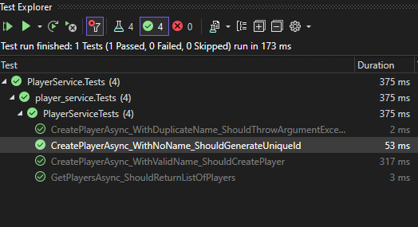

# Multiplayer Game Lobby System

## Overview

This is a simple multiplayer game lobby system built using a REST API. The system allows players to join a static lobby (`lobby_1`) and handles multiple requests across a clustered environment using Redis for in-memory state management.

## Features

1. **Static Lobby Name:** The lobby name is `lobby_1`.
2. **Player Lobby Joining:** Players can join the lobby using REST API.
3. **Lobby Capacity:** The lobby can handle up to 64 players. Join requests are rejected once the lobby reaches full capacity.
4. **Player Notifications:** Players are notified when they successfully join the lobby, with the current number of players.
5. **Clustered Environment:** The application runs in multiple containers, synchronized using Redis for state management.
6. **Redis for In-Memory State:** Redis is used to manage lobby and player state across the clustered containers.
7. **Scalability:** The system supports multiple players and lobbies concurrently.
8. **Bonus Features:**
   - Optional WebSocket or TCP connections for real-time updates.
   - Docker and Kubernetes configuration for deployment and scaling.

## Project Structure:

multiplayer-game-lobby-system/
│
└─── backend-services/
     ├─── PlayerService/
     │    ├─── PlayerService.csproj
     │    ├─── Controllers/
     │    ├─── Services/
     │    └─── Models/
     │
     ├─── LobbyService/
     │    ├─── LobbyService.csproj
     │    ├─── Controllers/
     │    ├─── Services/
     │    └─── Models/
     │
     ├─── NotificationService/
     │    ├─── NotificationService.csproj
     │    ├─── Controllers/
     │    └─── SignalR/
     │
     ├─── ApiGateway/
     │    ├─── ocelot.json
     │    ├─── ApiGateway.csproj
     │
     └─── Redis (for in-memory state)

## Requirements

- **Language/Framework:** .NET Core 8.
- **In-Memory System:** Redis for state management.
- **EDA**: Rabbitmq for message brooker and event driven feature.
- **Clustered Environment:** Docker, Kubernetes.

## Unit Tests

### Overview

Unit tests are implemented using **xUnit** with **Moq** for mocking dependencies. The tests ensure that the key features of `PlayerService` behave as expected.

### Test Cases:

1. **CreatePlayerAsync_WithValidName_ShouldCreatePlayer** :

* Validates that a player is created with the specified name and is added to the repository.

1. **CreatePlayerAsync_WithDuplicateName_ShouldThrowArgumentException** :

* Ensures that creating a player with an already taken name results in an exception.

1. **CreatePlayerAsync_WithNoName_ShouldGenerateUniqueId** :

* Ensures that if no player name is provided, a unique name prefixed with `"Guest_"` is generated.

1. **GetPlayersAsync_ShouldReturnListOfPlayers** :

* Validates that the service returns the correct list of players from the repository.

