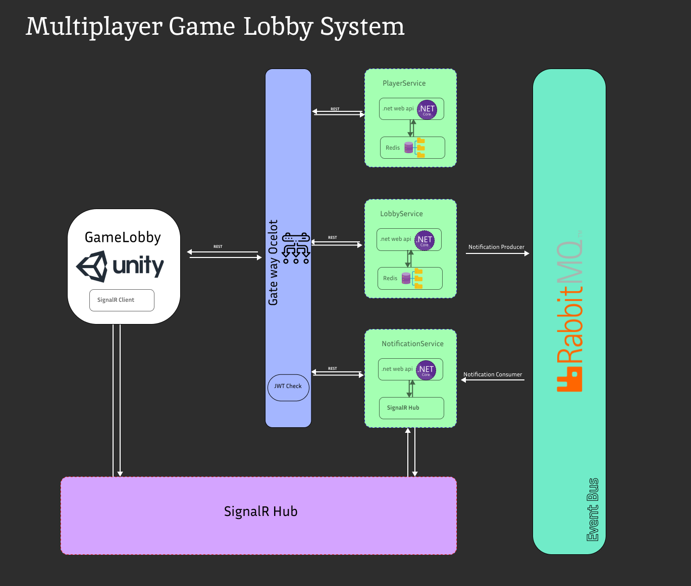

# Multiplayer Game Lobby System

## Overview

This is a simple multiplayer game lobby system built using a REST API. The system allows players to join a dynamic lobby (`lobby_1`) and handles multiple requests across a clustered environment using Redis for in-memory state management.



## Features

1. **Dynamic Lobby Name:** The lobby name like `lobby_1`.
2. **Player Lobby Joining:** Players can join the lobby using REST API.
3. **Lobby Capacity:** The lobby can handle up to 64 players. Join requests are rejected once the lobby reaches full capacity.
4. **Player Notifications:** Players are notified when they successfully join the lobby, with the current number of players.
5. **Clustered Environment:** The application runs in multiple containers, synchronized using Redis for state management.
6. **Redis for In-Memory State:** Redis is used to manage lobby and player state across the clustered containers.
7. **Scalability:** The system supports multiple players and lobbies concurrently.
8. **Bonus Features:**
   - Optional WebSocket or TCP connections for real-time updates.
   - Docker and Kubernetes configuration for deployment and scaling.

## Project Structure:

```
multiplayer-game-lobby-system/
│
└─── backend-services/
     ├─── PlayerService/
     │    ├─── PlayerService.csproj
     │    ├─── Controllers/
     │    ├─── Services/
     │    ├─── Repositories/
     │    └─── Models/
     │
     ├─── LobbyService/
     │    ├─── LobbyService.csproj
     │    ├─── Controllers/
     │    ├─── Services/
     │    ├─── Repositories/
     │    └─── Models/
     │
     ├─── NotificationService/
     │    ├─── NotificationService.csproj
     │    ├─── Controllers/
     │    ├─── SignalR/
     │    └─── Events/
     │
     ├─── ApiGateway/
     │    ├─── ocelot.json
     │    ├─── ApiGateway.csproj
     │
     ├─── SharedUtils/
     │    ├─── Events/
     │    ├─── RedisKeyHelper.cs
     │
     └─── Redis (for in-memory state)

```

## Technology Stack

- **.NET Core 8** : The main framework for building the REST API services.
- **Redis** : For in-memory state management across clusters.
- **RabbitMQ** : Message broker for the event-driven architecture (EDA).
- **Ocelot API Gateway** : For handling API routing across different services.
- **Docker & Kubernetes** : Containerization and orchestration to deploy services in a scalable manner.
- **SignalR** : Optional real-time communication using WebSockets.
- **OpenSSL** : For generating HTTPS certificates for secure communication.

## EndPoints:

Base URL: `https://localhost:7000/api/`

| HTTP Method | Endpoint                                  | Description                                     |
| ----------- | ----------------------------------------- | ----------------------------------------------- |
| POST        | /api/player                               | Creates a new player.                           |
| GET         | /api/player                               | Retrieves the list of all players.              |
| POST        | /api/lobby                                | Creates a new lobby.                            |
| POST        | /api/lobby/{lobbyId}/join?playerId={id}   | Adds a player to the specified lobb            |
| POST        | /api/lobby/{lobbyId}/remove?playerId={id} | Removes a player from the specified lobby.     |
| GET         | /api/lobby/{lobbyId}                      | Retrieves the details of the specified lobby.  |
| GET         | /api/lobby                                | Retrieves the list of all lobbies.              |
| POST        | /api/notification/send?message={message}  | Sends a notification to all connected clients. |

## Docker Overview:

```
cd ./backend-servicesdocker 
compose up -d --build 
```


## openssl certificate generate for HTTPS:

#### step1:

mkdir ~:\gh\project-name\certs

cd Directory: ~:\gh\project-name\certs

openssl req -x509 -newkey rsa:4096 -sha256 -days 3650 -nodes -keyout key.pem -out cert.pem -subj "/C=US/ST=Tehran/L=Tehran /O=ArsacidTechnologies Name/OU=IT Department/CN=localhost" -passout pass:MehranPfx

#### step2:

openssl pkcs12 -export -out certificate.pfx -inkey key.pem -in cert.pem -password pass:MehranPfx

dotnet dev-certs https --trust
