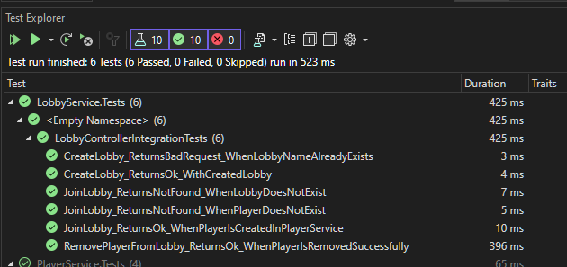

### **Lobby Joining Rules**

A user can join a lobby under the following conditions:

1. **User Validation** : The user's ID must exist in Redis, ensuring the user is recognized as a valid player.
2. **Lobby Capacity** : The lobby must have available space. Lobbies have a maximum capacity, and if the lobby is full, the user will be unable to join.

### **Exceptions**

* **User Already in a Lobby** : If a user is already a member of a lobby, they should not be allowed to join another lobby. This scenario must be handled to prevent a user from being part of multiple lobbies at the same time.

### **Redis Key Structure** :

1. **Lobby Sets** :

* Redis **set** where the key is `lobby:<lobbyId>:players` and the members are the player IDs.
* This allows you to quickly check if a lobby contains a player and to add/remove players from the lobby.

```
lobby:lobby1:players => { "player123", "player456" }

```

 **User’s Lobby** :

* A Redis **string** where the key is `user:<playerId>:lobby` and the value is the lobby ID.
* This allows you to quickly check which lobby a player is currently in.

Example:

```
user:player123:lobby => "lobby1"

```

## Integration Test Result:


